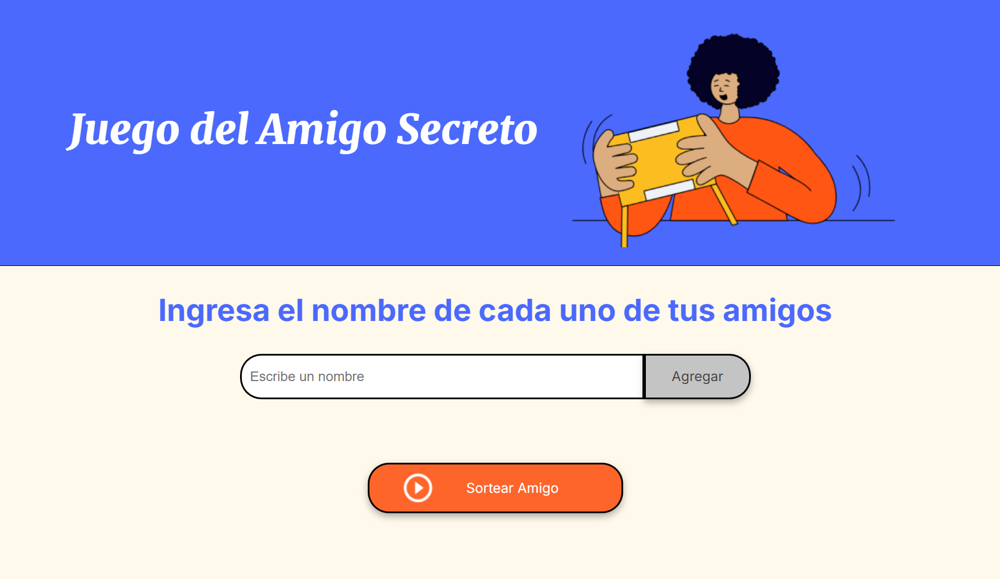
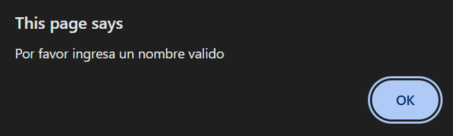
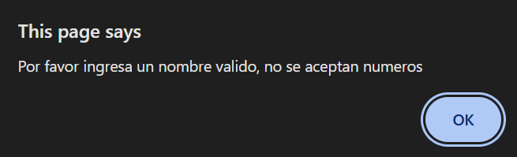
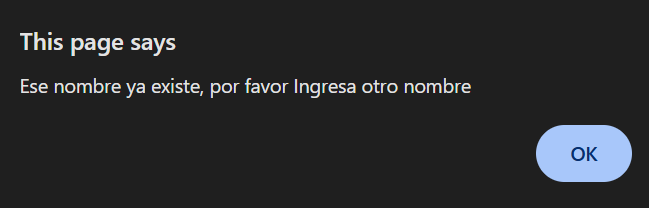

<h1> Juego Amigo Secreto desarrollado en Javascript como parte del challenge de Alura LATAM </h1>

- Estado del proyecto: Finalizado y en etapa de revision para calificacion.

- Se agregaron los archivos index.html , app.js, style.css y la carpeta de assets.
  
- Para ejecutar el juego, debes cargar el archivo index.html desde tu navegador.

- Una vez que se ha cargado en el navegador el archivo index.html podras tener acceso a la interface del usuario.
  
- Antes de Jugar, quiero explicarte un poco sobre la funcionalidad del juego:
-   1) El jugador debe ir agregando nombres en el campo de texto, no hay un limite de nombres a ingresar.
    2) El programa valida los datos que se estan ingresando, entre las validaciones principales podriamos mencionar:
       a) Se valida que no hayan nombres vacios.
  
       b) Se valida que no se ingresen numeros.
       
       c) Se valida que no se repitan los nombres de los amigos.
  

Cada una de las validaciones presenta una alerta mostrando el error.
    4) Una vez concluidas las validaciones, se procede a realizar el ingreso de los datos en el campo de texto y los confirma presionando el boton "Agregar".
    5) Cada nombre que se va ingresando se mostrara en la pantalla como una lista.
    
    6) Cuando hayas registrado los nombres en tu lista, puedes presionar el boton de sortear amigo y esta accion limpiara la lista de nombres y realizara un sorteo aleatorio para mostrar el nombre de un amigo secreto.
      a) Cabe mencionar que durante el sorteo se validan ciertos detalles como ser:
        - Que no se hayan sorteado todos los nombres de la lista.
        - Que hayan nombres en una lista para sortear.
        - Que no se repita el valor del nombre en caso de que ya haya salido sorteado.
      
    Espero te diviertas!!     
    
 

